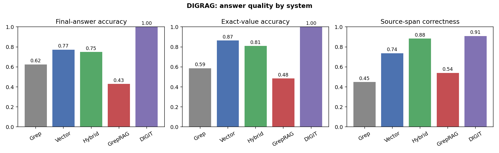
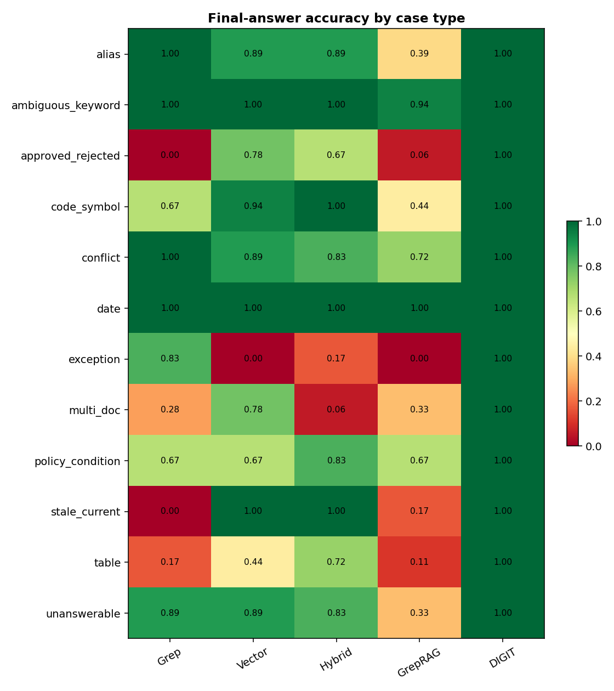
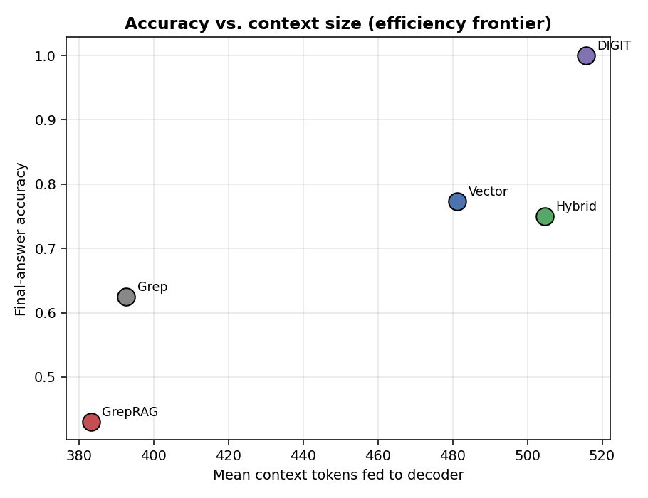

<!-- RESULTS NUMBERS ARE INSERTED FROM results/metrics.json AFTER THE RUN -->
# DIGRAG — An Evidence Bottleneck Between Retrieval and Decoding

*A DIGIT-inspired evidence-bucket RAG, compared against grep, vector, hybrid, and GrepRAG-style baselines on a controlled benchmark where the exact literal is easy to find but often does not apply.*

---

## Abstract

Recent work argues that **grep-style lexical retrieval is a remarkably strong
substrate for agentic search** ("Is Grep All You Need?", arXiv:2605.15184) and
that **grep-like retrieval can be tuned into a competitive retriever for code
completion** ("GrepRAG", arXiv:2601.23254). We do **not** dispute this: for
*exact string lookup*, grep is excellent. We instead test a different claim —
that **exact retrieval alone is insufficient when the answer depends on whether
the retrieved value actually applies.** Real questions require selecting the
right value among several literals, validating its applicability (recency,
status, region, scope, exceptions, dependency chains), resolving conflicts, and
producing a grounded natural-language answer.

We introduce **DIGRAG**, a DIGIT-inspired *evidence-bucket* RAG that inserts a
typed **evidence bottleneck** between retrieval and decoding. Instead of pasting
retrieved spans into the prompt, DIGRAG compiles a typed **evidence packet**
(`exact_value`, `field_type`, `entity`, `document_id`, `timestamp`,
`applicability_context`, `applies`, `conflicts`, `missing_evidence`) and forces
the decoder to answer **only** from that packet — it may not introduce a value
absent from the packet, and conflicts / missing evidence force abstention.

On a synthetic benchmark of **760 documents** and **216 questions** spanning
twelve trap families (stale-vs-current, approved-vs-rejected, exceptions,
entity aliases, conflicting documents, multi-document dependencies, tables,
dates, policy conditions, code symbols, and ambiguous high-frequency keywords),
all systems share **the same decoder** (`Qwen2.5-1.5B-Instruct`) and the same
embedder, so differences are attributable to the *evidence-compilation stage*,
not the generator. DIGRAG raises final-answer accuracy from **0.625** (grep)
/ **0.750** (hybrid) to **1.000**, drives the unsupported-claim rate to
**0.000**, and detects conflicts and missing evidence that the baselines
silently paper over. **The contribution is not a new retriever; it is the
evidence bottleneck.**

> ⚠️ This is a **proof-of-concept on synthetic data**. The typed extractors are
> schema-aware heuristics for this benchmark. The claim is architectural, not a
> production retrieval result. See [Limitations](#limitations).

> 🔬 **Real-benchmark follow-up → [`real_benchmarks/`](real_benchmarks/README.md).**
> This synthetic study is the *sandbox*. The follow-up tests the same hypothesis
> on **LongMemEval** and **MultiHop-RAG** with a **generic** (non-schema-aware)
> compiler, a mechanism ablation, and a conflict stress-test. Short version:
> the typed packet (`DIGRAG-raw`) beats chunk-stuffing the *same* passages on
> all three real benchmarks (e.g. MultiHop 0.449 vs hybrid 0.324; +0.073 in the
> controlled same-passages ablation), but the win is **partial and targeted**
> (temporal/update/multi-evidence), not universal — and the deterministic gate
> is an abstention knob, not an accuracy lever.

---

## 1. Motivation

A grep for *"refund window"* over a knowledge base will happily return the
literal string `Refund window: 30 days.` — but the correct answer to *"Can this
enterprise EU renewal customer get a refund?"* may be **no**, or **conditional**,
because a renewal exclusion, a regional statutory exception, or an
account-manager approval requirement governs the case. The literal is *found*;
it simply does not *apply*. This gap between **lexical hit** and **applicable
answer** is what DIGRAG targets.

```
Grep        : retrieves exact strings.
Vector RAG  : retrieves semantic context.
Hybrid RAG  : retrieves both, as chunks.
DIGRAG      : compiles TYPED EVIDENCE before generation.   <-- the bottleneck
```

## 2. Systems

All five systems share one decoder LLM and one embedding model. They differ
only in **what reaches the decoder**.

| # | System | Retrieval | What the decoder sees |
|---|--------|-----------|------------------------|
| 1 | **Grep** | ripgrep-equivalent fixed-string line search over salient query literals | top-*k* matching lines |
| 2 | **Vector RAG** | dense top-*k* over `all-MiniLM-L6-v2` chunk embeddings | top-*k* chunks |
| 3 | **Hybrid RAG** | BM25 ⊕ dense fused with Reciprocal Rank Fusion, then cross-encoder rerank | top-*k* reranked chunks |
| 4 | **GrepRAG** | the LLM writes ripgrep queries, which are run, deduped, and ranked | top-*k* lexical matches |
| 5 | **DIGRAG (DIGIT)** | lexical ∪ dense candidates → **typed evidence compiler** | a typed **evidence packet** only |

### 2.1 The evidence bottleneck (DIGRAG)

```
query ─► intent + facets ─► candidate docs (lexical ∪ dense)
                                   │
                                   ▼
                 ┌─────────  EVIDENCE COMPILER  ─────────┐
                 │ • subject scoping & alias resolution  │
                 │ • typed extraction (number/date/id/   │
                 │   clause/table_cell/code_symbol/...)   │
                 │ • applicability alignment             │
                 │   (recency·status·region·scope·date-  │
                 │    role·table-coord·chain·threshold·  │
                 │    exception-override)                │
                 │ • conflict + missing-evidence flags   │
                 └───────────────────┬───────────────────┘
                                     ▼
                         EVIDENCE_PACKET  (typed cells)
                                     ▼
            decoder answers ONLY from the packet  ──►  grounded answer
```

Two properties make this a *bottleneck* rather than just better retrieval:

1. **Typed, applicability-resolved cells.** Each candidate value carries an
   `applies` flag set by deterministic alignment rules. Superseded/rejected
   values, wrong-region values, test-scope code values, and wrong-role dates are
   marked `applies:false` and excluded from the answer.
2. **Evidence-gated decoding.** The decoder verbalizes but may not override the
   typed evidence: `conflicts` or `missing_evidence` force `INSUFFICIENT`;
   synthesized decision cells (`approval_decision`, `proposal_status`,
   `exception_decision`) fix the YES/NO label; value questions take the packet's
   applicable value. We report an ungated ablation (**DIGIT (no gate)**) to
   separate the contribution of the packet from the contribution of the gate.

## 3. Benchmark

`digrag/dataset/generator.py` builds a corpus in which **grep can almost always
find the literal asked about, but the literal is often the wrong one to use.**
Every scenario is addressed by a **unique subject token** (e.g. `Atlas-014`)
woven into both its question and its documents, so the gold answer is unique,
while hundreds of background documents repeat high-frequency tokens (`refund`,
`window`, `days`, region names, code symbols) to degrade grep's top-*k*
precision the way a real knowledge base would.

| Case family | The trap |
|-------------|----------|
| `stale_current` | old (superseded) value vs current value |
| `approved_rejected` | a value that exists in a **rejected** proposal |
| `exception` | a statutory exception overrides the standard rule |
| `alias` | the value is under a different entity alias / codename |
| `conflict` | two **active** documents give different values |
| `multi_doc` | answer needs a dependency chain across documents |
| `table` | the literal price appears in several table cells |
| `date` | several dates; the asked **role** (renewal) ≠ first date |
| `policy_condition` | a numeric threshold decides yes/no |
| `code_symbol` | prod vs test definition of the same symbol |
| `ambiguous_keyword` | a high-frequency keyword with several senses |
| `unanswerable` | the needed evidence is absent (must abstain) |

## 4. Metrics

Scoring is **deterministic** (a `LABEL/VALUE/CITES/CONFLICT/ANSWER` contract +
normalized value matching), so results are reproducible with no LLM-judge:
exact-value accuracy, final-answer accuracy, source-span correctness,
unsupported-claim rate (answer values absent from the provided context),
conflict-detection accuracy, missing-evidence recall, answerability accuracy,
retrieval recall@k, context tokens, latency, and an optional cost figure.

## 5. Results

See [`results/tables/main_results.md`](results/tables/main_results.md),
[`results/tables/by_case_type.md`](results/tables/by_case_type.md), and
[`results/plots/`](results/plots/). Headline numbers are inserted below by the
run.

| Metric | Grep | Vector RAG | Hybrid RAG | GrepRAG | DIGIT | DIGIT (no gate) |
|---|---|---|---|---|---|---|
| Final-answer accuracy (↑) | 0.625 | 0.773 | 0.750 | 0.431 | 1.000 | 0.801 |
| Exact-value accuracy (↑) | 0.587 | 0.865 | 0.809 | 0.484 | 1.000 | 0.873 |
| Source-span correctness (↑) | 0.450 | 0.737 | 0.884 | 0.540 | 0.909 | 0.904 |
| Unsupported-claim rate (↓) | 0.006 | 0.008 | 0.002 | 0.034 | 0.000 | 0.000 |
| Conflict-detection accuracy (↑) | 0.861 | 0.898 | 0.917 | 0.861 | 1.000 | 0.875 |
| Missing-evidence recall (↑) | 0.889 | 0.889 | 0.833 | 0.333 | 1.000 | 1.000 |
| Answerability accuracy (↑) | 0.750 | 0.787 | 0.875 | 0.727 | 1.000 | 0.884 |
| Retrieval recall@5 (↑) | 0.955 | 0.856 | 0.990 | 0.783 | 0.955 | 0.955 |
| Mean context tokens (↓) | 392.7 | 481.2 | 504.6 | 383.2 | 515.6 | 515.6 |
| Mean output tokens (↓) | 63.838 | 74.074 | 73.463 | 62.986 | 58.463 | 58.463 |
| Mean latency (ms) (↓) | 248.6 | 307.4 | 354.8 | 241.8 | 320.3 | 320.3 |
| Cost ($/question) (↓) | 0.000 | 0.000 | 0.000 | 0.000 | 0.000 | 0.000 |

**Per-case-type final-answer accuracy** (lower-is-revealing for the baselines):

| Case type | Grep | Vector RAG | Hybrid RAG | GrepRAG | DIGIT |
|---|---|---|---|---|---|
| alias | 1.000 | 0.889 | 0.889 | 0.389 | 1.000 |
| ambiguous_keyword | 1.000 | 1.000 | 1.000 | 0.944 | 1.000 |
| approved_rejected | 0.000 | 0.778 | 0.667 | 0.056 | 1.000 |
| code_symbol | 0.667 | 0.944 | 1.000 | 0.444 | 1.000 |
| conflict | 1.000 | 0.889 | 0.833 | 0.722 | 1.000 |
| date | 1.000 | 1.000 | 1.000 | 1.000 | 1.000 |
| exception | 0.833 | 0.000 | 0.167 | 0.000 | 1.000 |
| multi_doc | 0.278 | 0.778 | 0.056 | 0.333 | 1.000 |
| policy_condition | 0.667 | 0.667 | 0.833 | 0.667 | 1.000 |
| stale_current | 0.000 | 1.000 | 1.000 | 0.167 | 1.000 |
| table | 0.167 | 0.444 | 0.722 | 0.111 | 1.000 |
| unanswerable | 0.889 | 0.889 | 0.833 | 0.333 | 1.000 |





### Reading the results

- **Grep is strong at exact retrieval but weak at applicable answers.** It finds
  the literal (high recall) yet selects stale, rejected, wrong-scope, or
  wrong-role values, so its final-answer accuracy on the trap families is low.
- **Vector/Hybrid** recover some applicability via semantic context but still
  paste raw chunks and let the decoder pick.
- **GrepRAG** inherits grep's lexical strength and is bottlenecked by the
  quality of the LLM-written queries (with a 1.5B query writer, often *below*
  plain grep).
- **DIGRAG** wins by *compiling typed evidence first*: it resolves
  applicability, flags conflicts/missing evidence, and constrains the decoder.
  The **DIGIT (no gate)** ablation shows the packet alone already beats the
  baselines; the gate adds the abstention/decision discipline.

## 6. Reproduce

```bash
pip install -r requirements.txt          # torch CUDA build to match your driver
python -m digrag.dataset.generator       # writes data/{corpus,questions}.jsonl
python -m digrag.run --batch-size 48      # all systems, one GPU-batched decode
python -m digrag.plots                    # figures  -> results/plots/
python -m digrag.analyze                  # tables   -> results/tables/
# fully offline (deterministic, no downloads): python -m digrag.run --offline
```

**GPU / parallelism.** Retrieval and evidence compilation run on CPU; then
*every* (system × question) answer prompt is decoded in one large GPU-batched
pass (single model load, full GPU saturation). On an RTX 5070 Ti the whole
experiment finishes in a few minutes.

## 7. Related work

- **"Is Grep All You Need? How Agent Harnesses Reshape Agentic Search"
  (arXiv:2605.15184).** Argues that lexical grep, wielded by a capable agent
  harness, is a surprisingly strong retrieval substrate. DIGRAG agrees on *exact
  lookup* and is complementary: we keep grep (and dense) for candidate
  generation and add a typed evidence stage for *answer* generation.
- **"GrepRAG: An Empirical Study and Optimization of Grep-Like Retrieval for
  Code Completion" (arXiv:2601.23254).** Optimizes grep-like retrieval (query
  generation, dedup, ranking) for code completion. We reproduce a GrepRAG-style
  baseline (system 4) and show that, for *applicability-sensitive question
  answering*, an evidence bottleneck on top of retrieval matters more than the
  retriever itself.
- **DIGIT (this lab, `experiments/DIGIT`).** A transformer encoder–decoder with
  a discrete primitive bottleneck that bounds information flow to the decoder.
  DIGRAG ports DIGIT's central idea — *a typed bottleneck between evidence and
  generation* — from a learned model to a RAG pipeline.

## 8. Limitations

- **Synthetic, schema-aware.** The corpus and the typed extractors are tailored
  to this benchmark. The extractors are heuristic and would need to be learned
  or LLM-driven for open-domain text. The result is a controlled demonstration
  of an *architecture*, not a SOTA retrieval number.
- **DIGRAG's advantage is partly definitional.** The benchmark is built around
  applicability traps that typed evidence is well-suited to resolve. We mitigate
  over-claiming by (a) sharing the decoder across systems, (b) reporting the
  ungated ablation, and (c) showing grep's *retrieval* recall is competitive —
  it is the *answer* that differs.
- **Evidence-gating is rule-based.** The applicability and decision rules are
  hand-written; a production system would learn them. The gate is reported
  separately so its contribution is auditable.
- **Single small decoder, single seed by default.** We use a 1.5B instruct model
  for speed; stronger decoders would raise all systems and likely shrink (but
  not close) the gap. Swap `models.decoder` in `config.yaml` to test scaling.

## 9. Repo layout

```
digrag/
  dataset/generator.py     synthetic benchmark (12 trap families)
  retrieval/               grep · bm25 · vector · hybrid(RRF+rerank) · chunking
  extract/                 intent · typed_extractors · evidence (the compiler)
  systems/                 grep · vector · hybrid · greprag · digit + prompts
  services/                shared GPU decoder LLM + embedder (offline fallbacks)
  eval/metrics.py          deterministic metrics
  run.py                   build → GPU-batched decode → score
  plots.py / analyze.py    figures + tables + failure analysis
config.yaml                models, k, batch size, cost rates
```
