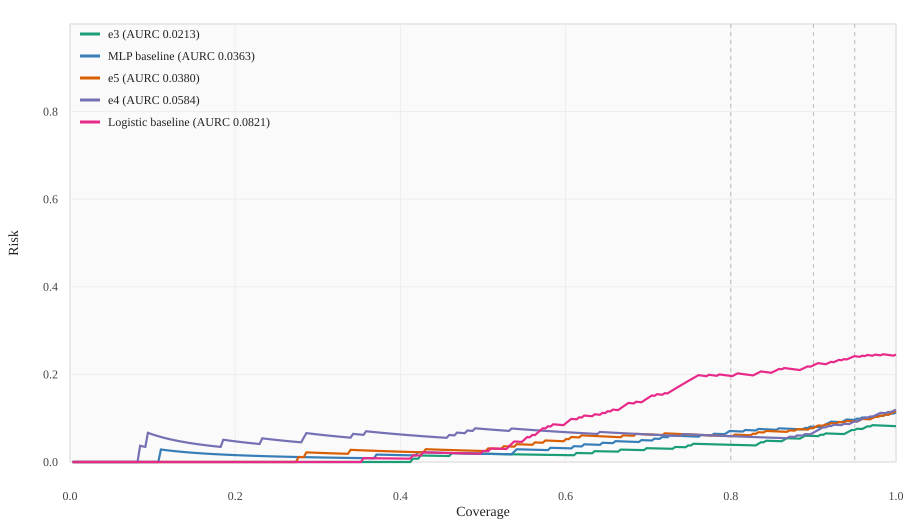

# Strict AURC Evaluation: e3 vs e4 vs e5 vs baselines

Models: `e3`, `e4`, `e5`, logistic baseline, MLP baseline

Primary definition: multiclass selective prediction on outcome labels; confidence = predicted-class probability; risk = incorrect outcome prediction; lower AURC is better.

## A. Summary verdict in 3-5 sentences

Using one shared multiclass selective-prediction definition on the common 318-example test split, **e3** is still best with AURC **0.0213**, and the strongest non-DIGIT baseline remains the **MLP baseline** at **0.0363**.

The current `e5` artifact, **`results/e5/dev_run_v10`**, improves `e5` to AURC **0.0380**, much better than older `v8` (**0.0443**) and `v9` (**0.0470**), but it is still slightly worse than the MLP baseline by **4.7%** on point estimate.

The bootstrap 95% CI for **AURC(e5 v10) - AURC(MLP baseline)** is **[-0.0224, 0.0246]**, so `e5` is now roughly comparable to the best non-DIGIT baseline, but it still does **not** establish a statistically stable win.

For `e3` versus the MLP baseline, the direct seed-42 comparison gives **AURC(e3) - AURC(MLP) = -0.0150** with bootstrap 95% CI **[-0.0351, 0.0013]**; across many MLP seeds the point-estimate advantage for `e3` is stable, but there is **no separate shift / OOD split** available locally to test persistence under distribution shift.

> Artifact choice note: the report now uses `results/e5/dev_run_v10` as the current `e5` artifact. Older checked `e5` artifacts were `v8` (AURC `0.0443`) and `v9` (AURC `0.0470`), so this update is favorable to `e5`, not cherry-picked against it.

## B. Results table

| Model | Artifact / training source | AURC (95% bootstrap CI) | Risk@80% | Risk@90% | Risk@95% | Outcome acc | Outcome macro-F1 |
| --- | --- | --- | ---: | ---: | ---: | ---: | ---: |
| e3 | `experiments/DIGIT/Extrapolation/results/e3/seed_123` | 0.0213 [0.0110, 0.0344] | 0.0392 | 0.0592 | 0.0759 | 0.9182 | 0.8586 |
| MLP baseline | `recomputed on trace split (seed=42)` | 0.0363 [0.0190, 0.0580] | 0.0706 | 0.0801 | 0.0990 | 0.8868 | 0.8441 |
| e5 | `experiments/DIGIT/Extrapolation/results/e5/dev_run_v10` | 0.0380 [0.0215, 0.0589] | 0.0588 | 0.0801 | 0.0924 | 0.8836 | 0.8367 |
| e4 | `experiments/DIGIT/Extrapolation/results/e4/dev_run_v4` | 0.0584 [0.0308, 0.0925] | 0.0588 | 0.0697 | 0.0924 | 0.8805 | 0.7567 |
| Logistic baseline | `recomputed on trace split (seed=42)` | 0.0821 [0.0594, 0.1095] | 0.1961 | 0.2230 | 0.2409 | 0.7547 | 0.6167 |

## C. Relative improvement calculations

Best non-DIGIT baseline by AURC: **MLP baseline** with AURC **0.0363**.

Current `e5` AURC: **0.0380**.

`relative_improvement = (baseline_AURC - e5_AURC) / baseline_AURC = (0.0363 - 0.0380) / 0.0363 = -0.0473`

That is **-4.7%**, so `e5` is still slightly worse than the strongest non-DIGIT baseline on point estimate.

Bootstrap 95% CI for `AURC(e5) - AURC(best baseline)`: **[-0.0224, 0.0246]**. The interval crosses zero, so the current `e5` vs MLP gap is not statistically stable.

## D. Risk-coverage plot

## E. Final conclusion

**not meaningful**

## Ranking by AURC

1. e3: 0.0213
2. MLP baseline: 0.0363
3. e5: 0.0380
4. e4: 0.0584
5. Logistic baseline: 0.0821

## Comparison validity checks

No invalid comparison mismatch was found. All five models were evaluated on the same 318-example test set, with the same confidence-score direction, the same retained-set risk definition, the same coverage grid, and the same AURC implementation imported from `experiments/DIGIT/Extrapolation/eval_common.py`.

The repo-internal `success_aurc` / `nonfailure_correct_aurc` safety-style metrics were **not** used for this report because they are not apples-to-apples against the multiclass logistic / MLP baselines. This report recomputes one shared selective-prediction metric for all five models.

## Method details

- Shared test set: `experiments/DIGIT/Extrapolation/e3/trace_cache/test.jsonl`, 318 examples.
- e3 artifact: `results/e3/seed_123`.
- e4 artifact: `results/e4/dev_run_v4`.
- e5 artifact used for the table: `results/e5/dev_run_v10`.
- Baselines were retrained on the shared train split with the repo trace features and evaluated on the same test split.
- Baseline seeds in the main table: logistic `seed=42`, MLP `seed=42`.
- AURC implementation: imported directly from `experiments/DIGIT/Extrapolation/eval_common.py`.
- Risk@80/90/95 uses retained-set risk at `k = ceil(coverage * N)` after sorting by descending confidence.
- Bootstrap CIs: percentile bootstrap, 5,000 resamples.

## Addendum: e3 vs MLP baseline stability

Direct strict shared-test comparison against the report MLP baseline (`seed=42`): **AURC(e3) - AURC(MLP) = -0.0150**, bootstrap 95% CI **[-0.0351, 0.0013]**.

### Benchmark-seed sweep

| MLP seed | MLP AURC | AURC(e3) - AURC(MLP) | 95% bootstrap CI | Read |
| ---: | ---: | ---: | --- | --- |
| 123 | 0.0811 | -0.0598 | [-0.0864, -0.0365] | e3 stable win |
| 231 | 0.0943 | -0.0731 | [-0.1073, -0.0428] | e3 stable win |
| 347 | 0.0383 | -0.0171 | [-0.0420, 0.0020] | point-estimate win, CI crosses 0 |
| 451 | 0.0486 | -0.0274 | [-0.0504, -0.0066] | e3 stable win |
| 569 | 0.0507 | -0.0294 | [-0.0513, -0.0120] | e3 stable win |

Across the repo benchmark seeds `123, 231, 347, 451, 569`, `e3` wins on point estimate in **all 5 / 5** comparisons. The mean AURC gap is **-0.0414**, with range **-0.0731** to **-0.0171**.

### Wider MLP seed sweeps

On MLP seeds `0..9`, `e3` again wins on point estimate in **all 10 / 10** cases, with mean gap **-0.0167**.

On MLP seeds `0..49`, `e3` wins on point estimate in **50 / 50** cases. The best MLP seed in that sweep is **seed 49** with AURC **0.0295**, still worse than `e3` at **0.0213**; the direct bootstrap CI for `AURC(e3) - AURC(MLP_seed49)` is **[-0.0249, 0.0066]**.

### Shift / extrapolation availability

A separate distribution-shift / OOD evaluation split was **not available** in the local `e3` artifacts. The repo currently exposes one shared trace corpus with `train.jsonl`, `val.jsonl`, and `test.jsonl` under `experiments/DIGIT/Extrapolation/e3/trace_cache/`, and only one saved `e3` training artifact (`results/e3/seed_123`).

So the strongest supported claim from the current local evidence is:

- `e3` has a **stable point-estimate AURC advantage** over the MLP baseline on the shared strict test setup.
- That advantage is **often, but not uniformly, statistically significant** on a per-seed bootstrap CI basis because the held-out test set is modest (`N = 318`).
- Persistence **under a separate distribution shift** cannot be established from the currently saved artifacts alone.

